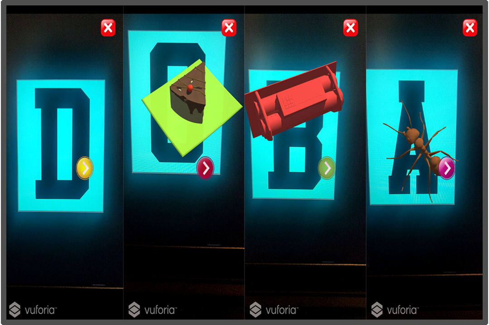

# Link : 
https://drive.google.com/drive/folders/1m0EromBH65cr1afzleHZkypzkDGLlmEa?usp=sharing

* Link contains the game project.
* Video preview of the game.

# Screenshot : 

# Education-AR-app-Unity
* An AR application which is made using Unity Game Engine and Vuforia Engine.
* It is an AR marker based application. 
* Assets are taken from CG trader and more websites for free
* Marker Based application which can be used for educating young toddlers

# Aim
* To create an application which can help in visualising education for toddlers of age 3-6 years.
* It helps in better learning and visualisation is improved.

# How to use the app.
* Either build the applicatio from the unity build manager
* You can also install the application given with this repository.
* Scan the given pictures or target images from your phone and Enjoy.

# System Requirements
* Windows 10 pro
* Unity 2018(LTS)
* Visual Studios 17 or above
* Core i5 processors 7th gen or above.
* Dedicated GPU (Nvidia or AMD) Recomended.

# Getting Started
* Start by downloading the project from given link at the top.
* Unity 2018 with (LTS) recomended or above.
* Start by opening Unity Engine and install the Vuforia Package from the package manager in the Unity application.

* Visual Studio 2019 or 2019 is recommended, It is made to run on Windows OS (8,10).
* Unity 2018(LTS) is recomended.
* Basics of C# language.

# Main features to come:
* More target image support
* Animations are to be added
* More fucntionalties.
* if feasible , Manomotion SDK support is to be added for better animation support.

